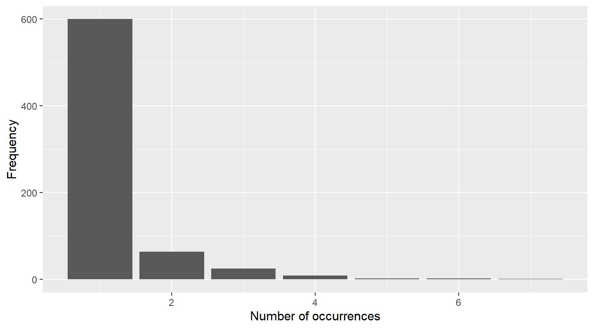
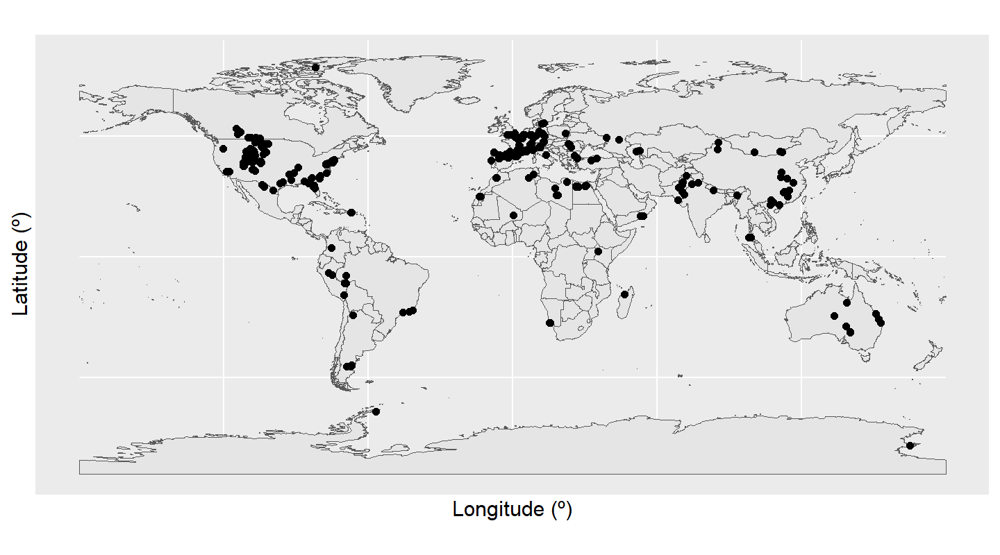
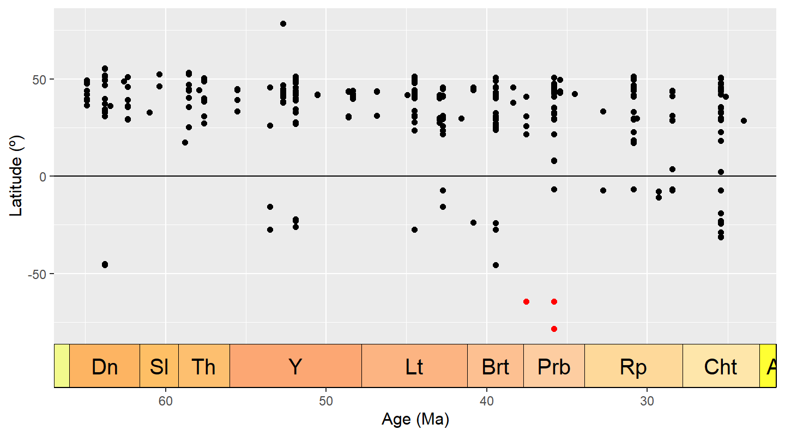
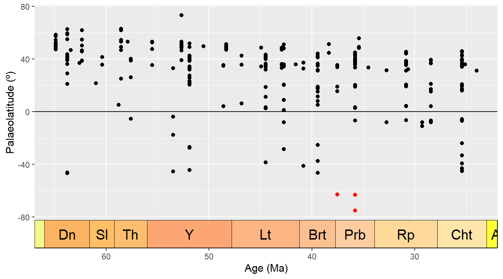
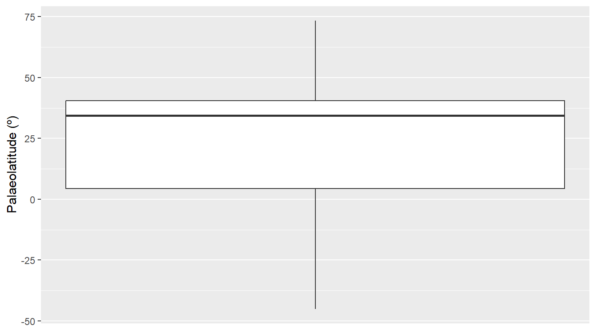

## Introduction

This vignette is an accompaniment to:

> Jones LA, Dean CD, Allen BJ, Drage HB, Flannery-Sutherland JT, Gearty W, Chiarenza AA, Dillon EM, Farina BM, and Godoy PL. Ten simple rules to follow when cleaning occurrence data in palaeobiology.

Here we present a full example workflow that complies with the ten rules we propose in the manuscript. The intention is to illustrate the concepts outlined in the manuscript, with further details and ideas for practical implementation, as well as code that can be repurposed by readers.

## Load packages

Before starting, we will load all of the R packages we need.


``` r
# install.packages(c("CoordinateCleaner", "deeptime", "dplyr", "fossilbrush",
# "ggplot2", "palaeoverse", "readr", "rgplates", "rnaturalearth",
# "rnaturalearthdata"))
library(CoordinateCleaner)
library(deeptime)
library(dplyr)
library(fossilbrush)
library(ggplot2)
library(palaeoverse)
library(readr)
library(rgplates)
library(rnaturalearth)
library(rnaturalearthdata)
```

## Rule 1: Choose the right data for your question

In this example, we are interested in the fossil record of crocodiles. As ectotherms, crocodiles are highly reliant on the environment in which they live in order to maintain a functional internal body temperature. Because of this, their spatial distribution is constrained to warm climates, so their fossil record is commonly used as an indicator of palaeoclimate. Here we will investigate the palaeodiversity of crocodiles, with the specific goal of reconstructing their latitudinal range throughout the Paleogene.

To meet this goal, we need to acquire occurrence data for fossil crocodiles during the Paleogene. Initially we have decided not to place further taxonomic constraints on our search, so we will include all occurrences belonging to the order 'Crocodylia'. We are interested in the clade's biogeography, so we will need all occurrences globally, and we need to ensure that we have geographic coordinates associated with our occurrences.

We will turn to one of the largest sources of fossil occurrence data, the [Paleobiology Database](https://paleobiodb.org). We opted to download our data by completing the 'Download' form on the Paleobiology Database website. Practically, this uses the options entered into the form to create a call to the database's API (application programming interface), and then enacts this call. More information about the API service can be found [here](https://paleobiodb.org/data1.2/).

For our dataset, we pulled all occurrences associated with the taxon name 'Crocodylia', dated to the 'Paleogene'. All other settings were left at default. We obtained the standard (or recommended) data fields by checking the box to "Include all output blocks whose names are boldfaced below", and obtained our data in the form of a '.csv' file. We will see later in the vignette what this means in terms of what is contained within the dataset.

## Rule 2: Keep raw data raw

For reproducibility, we want to make sure that we have a copy of the full dataset as initially downloaded - this is the "raw" data. Automatically, when we use the online form, there is an output option checked which is labelled "Include metadata at the beginning of the output". This ensures that the raw data file includes a metadata 'header', which contains useful information linked to the dataset.

We can load and view the metadata to see what it includes.


``` r
# Load data file
metadata <- read_csv("data/Paleogene_crocs.csv")
```

```
## Error: 'data/Paleogene_crocs.csv' does not exist in current working directory ('C:/Users/willg/OneDrive - Syracuse University/Syracuse').
```

``` r
# Trim to metadata
metadata <- metadata[1:23, ]

# Print
metadata
```

```
## # A tibble: 23 × 2
##    `Data Provider`   `The Paleobiology Database`                                                                
##    <chr>             <chr>                                                                                      
##  1 Data Source       The Paleobiology Database                                                                  
##  2 Data License      Creative Commons CC0                                                                       
##  3 License URL       https://creativecommons.org/publicdomain/zero/1.0/                                         
##  4 Documentation URL http://paleobiodb.org/data1.2/occs/list_doc.html                                           
##  5 Data URL          http://paleobiodb.org/data1.2/occs/list.csv?datainfo&rowcount&base_name=Crocodylia&interva…
##  6 Access Time       Fri 2025-02-21 14:41:31 GMT                                                                
##  7 Title             PBDB Data Service                                                                          
##  8 Parameters:       <NA>                                                                                       
##  9 <NA>              base_name,Crocodylia                                                                       
## 10 <NA>              pgm,gplates,scotese,seton                                                                  
## # ℹ 13 more rows
```

The metadata are strangely formatted here, but we can see that they include information about the data license (CC0), the API call used (under the label 'Data URL'), the date and time at which the data were accessed, and the total number of records contained within the dataset (here, 886 fossil occurrences).

These metadata elements are all important information to retain alongside our data, allowing others to better understand what the dataset contains, and when and how it was downloaded. The Paleobiology Database is fully dynamic, not only in that new data is continually being added, but also in that any record can be changed retrospectively by an Editor. It cannot be assumed that the 'present' state of any data record was the same in the (historical) past. So, for example, if someone wanted to see how the data associated with this API call had changed in the time elapsed since our download, they could do this, and directly in R if desired:


``` r
# View API URL
metadata[5, 2]
```

```
## # A tibble: 1 × 1
##   `The Paleobiology Database`                                                                                   
##   <chr>                                                                                                         
## 1 http://paleobiodb.org/data1.2/occs/list.csv?datainfo&rowcount&base_name=Crocodylia&interval=Paleogene&pgm=gpl…
```


``` r
# Use API call (this is not enacted here)
new_data <- read_csv(metadata[5, 2])
```

While the metadata is important to keep in the raw file, for the purposes of analysis, we want to be able to just read in the data beneath it. We can do this using the `skip` parameter in `read_csv`, which tells R to ignore a given number of rows at the top of the file.


``` r
# Load data file, skipping metadata
fossils <- read_csv("data/Paleogene_crocs.csv", skip = 19)
```

```
## Error: 'data/Paleogene_crocs.csv' does not exist in current working directory ('C:/Users/willg/OneDrive - Syracuse University/Syracuse').
```

When we use `read_csv()`, we get a message explaining how the data have been parsed into R. It's worth checking this for anything unusual, because if parsing has not occurred how we expected, it could lead to errors in the data. Here, we can see that there were two columns in the `csv` file named "cc", for "country code". Their column number has been appended to their column name, in order to keep these distinct. Is this column simply duplicated? We can check this.


``` r
# Are the two `cc` columns identical?
identical(fossils$cc...36, fossils$cc...58)
```

```
## Warning: Unknown or uninitialised column: `cc...36`.
```

```
## Warning: Unknown or uninitialised column: `cc...58`.
```

```
## [1] TRUE
```

This is true, so to keep our dataframe tidy, we will remove one of these columns and rename the other.


``` r
# Remove one `cc` column
fossils$cc...58 <- NULL

# Rename other column
colnames(fossils)[colnames(fossils) == 'cc...36'] <- 'cc'
```

And now we are ready to commence our data exploration and cleaning.

## Rule 3: Document your workflow

Documenting your workflow is essential for ensuring that others can understand and replicate all steps. Using programming languages such as R or Python makes this easy, as the code used can be provided alongside the data. Our vignette gives an example of how `markdown` can be a particularly useful tool for integrating code with prose, ensuring that everything is fully explained, and providing plots integrated within the text when exported.

Our tips for good documentation in R include:

- Following general guidelines for good coding, such as ample use of spacing to help human readability - Having a clear, overarching code structure (such as subsections, which can be denoted with headings and "#====" notation, and an order which corresponds to the flow of the research methods/results)
- Using logical yet short variable names
- Including comments throughout which explain both *what* and *why*

## Rule 4: Explore your data

The first thing we want to do with our data is *explore* it - that is, generate summary statistics and plots to help us understand the data and its various characteristics.

For example, we can look at the distribution of identification levels for our fossils.


``` r
# Count the frequency of taxonomic ranks
table(fossils$accepted_rank)
```

```
## 
##         family          genus        species      subfamily    superfamily unranked clade 
##              1            253            248              3             13            350
```

``` r
# Calculate as percentages
(table(fossils$accepted_rank) / nrow(fossils)) * 100
```

```
## 
##         family          genus        species      subfamily    superfamily unranked clade 
##      0.1152074     29.1474654     28.5714286      0.3456221      1.4976959     40.3225806
```

We can see that of our 886 occurrences, 250 (28%) are identified to species level. A further 254 (29%) are identified to genus level. The remaining fossils are more coarsely identified, including 365 (41%) which are identified to the mysterious level of "unranked clade".

Next, let's look at the distribution of fossils across localities. In the PBDB, fossils are placed within collections, each of which can roughly be considered a separate locality (they can also represent different sampling horizons at the same locality; more on this later). First, we can count the number of unique `collection_no` values to find out how many unique collections are in the dataset.


``` r
# What is the length of a vector of unique collection numbers?
length(unique(fossils$collection_no))
```

```
## [1] 703
```

Our dataset contains 720 unique collections. We can also create a plot showing us the distribution of occurrences across these collections.


``` r
# Count the number of times each collection number appears in the dataset
coll_no_freq <- as.data.frame(table(fossils$collection_no))

# Plot the distribution of number of occurrences per collection
ggplot(coll_no_freq, aes(x = Freq)) +
  geom_bar() +
  labs(x = "Number of occurrences",
       y = "Frequency")
```

<div class="figure">

<p class="caption">plot of chunk abundance_distribution</p>
</div>

We can see that the collection containing the most occurrences has 7, while the vast majority only contain a single occurrence.

What about the countries in which these fossils were found? We can investigate this using the "cc", or "country code" column.


``` r
# List unique country codes, and count them
unique(fossils$cc)
```

```
##  [1] "US" "CA" "PE" "IN" "FR" "MA" "BE" "RU" "AR" "ES" "UK" "DE" "KZ" "LY" "IT" "BR" "AU" "PK" "EG" "AA" "TR"
## [22] "CZ" "MG" "CN" "DK" "SE" "UA" "PL" "PR" "TH" "TN" "VN" "KE" "AT" "OM" "PT" NA   "CH" "EH" "ML" "RO" "NP"
## [43] "MN" "BG" "CO"
```

``` r
length(unique(fossils$cc))
```

```
## [1] 45
```

Here we can see that Paleogene crocodiles have been found in 46 different countries. Let's sort those values alphabetically to help us find specific countries.


``` r
# List and sort unique country codes, and count them
sort(unique(fossils$cc))
```

```
##  [1] "AA" "AR" "AT" "AU" "BE" "BG" "BR" "CA" "CH" "CN" "CO" "CZ" "DE" "DK" "EG" "EH" "ES" "FR" "IN" "IT" "KE"
## [22] "KZ" "LY" "MA" "MG" "ML" "MN" "NP" "OM" "PE" "PK" "PL" "PR" "PT" "RO" "RU" "SE" "TH" "TN" "TR" "UA" "UK"
## [43] "US" "VN"
```

``` r
length(sort(unique(fossils$cc)))
```

```
## [1] 44
```

Something weird has happened here: we can see that once the countries have been sorted, one of them has disappeared. Why? We will come back to this during our next rule.

## Rule 5: Identify and handle incomplete data records

By default, when we read data tables into R, it recognises empty cells and takes some course of action to manage them. When we use base R functions, such as `read.csv()`, empty cells are given an `NA` value ('not available') only when the column is considered to contain numerical data. When we use `Tidyverse` functions, such as `readr::read_csv()`, *all* empty cells are given `NA` values. This is important to bear in mind when we want to find those missing values: here, we have done the latter, so all empty cells are `NA`.

The extent of incompleteness of the different columns in our dataset is highly variable. For example, the number of `NA` values for the `collection_no` is 0.


``` r
# Count the number of collection number values for which `is.na()` is TRUE
sum(is.na(fossils$collection_no))
```

```
## [1] 0
```

This is because it is impossible to add an occurrence to the PBDB without putting it in a collection, which must in turn have an identification number.

However, what about `genus`?


``` r
# Count the number of genus IDs for which `is.na()` is TRUE
sum(is.na(fossils$genus))
```

```
## [1] 367
```

The value here is 382. This corresponds to the number of occurrences in our dataset which cannot be placed in a genus, i.e. their taxonomic identification is to a coarser taxonomic level.

What can, or should, we do about this? It depends heavily on the intersection between the different fields in the dataset, and our research question. In some instances it might be appropriate to ignore certain `NA` values: for example, `NA` values for `genus` might not matter if we want to see the spatial distribution of all crocodylian fossils, regardless of how coarsely identified they are.

Alternatively, it might be appropriate to filter these values out. For our crocodile example, we are interested in biogeography, so the latitude and longitude, and palaeolatitude and palaeolongitude, are pretty important. Do we have missing values there?


``` r
# Count the number of occurrences for which `is.na()` is TRUE in latitude,
# longitude, palaeolatitude, and palaeolongitude
sum(is.na(fossils$lat))
```

```
## [1] 0
```

``` r
sum(is.na(fossils$lng))
```

```
## [1] 0
```

``` r
sum(is.na(fossils$paleolat))
```

```
## [1] 0
```

``` r
sum(is.na(fossils$paleolng))
```

```
## [1] 0
```

While all occurrences have modern day coordinates, 18 are missing palaeocoordinates. We will now remove these 18 occurrences from the dataset.


``` r
# Remove occurrences which are missing palaeocoordinates
fossils <- filter(fossils, !is.na(fossils$paleolng))

# Check whether this has worked
sum(is.na(fossils$paleolat))
```

```
## [1] 0
```

``` r
sum(is.na(fossils$paleolng))
```

```
## [1] 0
```

A further option applicable in some cases would be to fill in our missing data. We may be able to interpolate values from the rest of our data, or use additional data sources. For our palaeogeography example above, we could generate our own coordinates, for example using `palaeoverse::palaeorotate()`.

Let's revisit our country example from Rule 5. Does our list of country codes contain NAs?


``` r
# Count the number of country codes for which `is.na()` is TRUE
sum(is.na(fossils$cc))
```

```
## [1] 2
```

Our test tells us that two of the values are `NA`: when we asked R to sort the values, it removed `NA` from the list of unique countries. However, the PBDB has set the country within which the collection is located as a compulsory entry field. How can we have missing data here? We don't: these values are not `NA`, they are "NA" meaning Namibia, and have been misconstrued by R. This is an important illustration of why we should conduct further investigation when any apparent errors arise in the dataset, rather than immediately removing these data points.

## Rule 6: Identify and handle outliers

Next, we want to look for outliers. Here we will focus in on the specific variables which relate to our scientific question, i.e. the geography of our fossil occurrences. First we'll plot where the crocodile fossils have been found across the globe: how does this match what we already know from the country codes?


``` r
# Load in a world map
world <- ne_countries(scale = "medium", returnclass = "sf")

# Plot the geographic coordinates of each locality over the world map
ggplot(fossils) +
  geom_sf(data = world) +
  geom_point(aes(x = lng, y = lat)) +
  labs(x = "Longitude (º)",
       y = "Latitude (º)")
```

<div class="figure">

<p class="caption">plot of chunk map</p>
</div>

We have a large density of crocodile occurrences in Europe and the western interior of the United States, along with a smattering of occurrences across the other continents. This distribution seems to fit our previous knowledge, that the occurrences are spread across 46 countries. However, the crocodile occurrences in Antarctica seem particularly suspicious: crocodiles need a warm climate, and modern-day Antarctica certainly doesn't fit this description. Let's investigate further. We'll do this by plotting the latitude of the occurrences through time.


``` r
# Add a column to the data frame with the midpoint of the fossil ages
fossils <- mutate(fossils, mid_age = (min_ma + max_ma) / 2)

# Create dataset containing only Antarctic fossils
Antarctic <- filter(fossils, cc == "AA")

# Plot the age of each occurrence against its latitude
ggplot(fossils, aes(x = mid_age, y = lat)) +
  geom_point(colour = "black") +
  geom_point(data = Antarctic, colour = "red") +
  labs(x = "Age (Ma)",
       y = "Latitude (º)") +
  scale_x_reverse() +
  geom_hline(yintercept = 0) +
  coord_geo(dat = "stages", expand = TRUE)
```

<div class="figure">

<p class="caption">plot of chunk lat_time</p>
</div>

Here we can see the latitude of each occurrence, plotted against the temporal midpoint of the collection. We have highlighted our Antarctic occurrences in red - these points are still looking pretty anomalous.

But, wait, we should actually be looking at **palaeo**latitude instead. Let's plot that against time.


``` r
# Plot the age of each occurrence against its palaeolatitude
ggplot(fossils, aes(x = mid_age, y = paleolat)) +
  geom_point(colour = "black") +
  geom_point(data = Antarctic, colour = "red") +
  labs(x = "Age (Ma)",
       y = "Palaeolatitude (º)") +
  scale_x_reverse() +
  geom_hline(yintercept = 0) +
  coord_geo(dat = "stages", expand = TRUE)
```

<div class="figure">

<p class="caption">plot of chunk palaeolat_time</p>
</div>

Hmm... when we look at palaeolatitude the Antarctic occurrences are even **further** south. Time to really check out these occurrences. Which collections are they within?


``` r
# Find Antarctic collection numbers
unique(Antarctic$collection_no)
```

```
## [1]  43030 120887  31173
```

Well, upon further visual inspection using the PBDB website, all appear to be fairly legitimate. However, all three occurrences still appear to be outliers, especially as in the late Eocene [temperatures were dropping](https://doi.org/10.1038/s41586-018-0272-2). What about the taxonomic certainty of these occurrences?


``` r
# List taxonomic names associated with Antarctic occurrences
Antarctic$identified_name
```

```
## [1] "Crocodilia indet." "Crocodylia indet." "Crocodylia indet."
```

Since all three occurrences are listed as "Crocodylia indet.", it may make sense to remove them from further analyses anyway.

Let's investigate if there are any other anomalies or outliers in our data. We'll bin the occurrences by stage to look for stage-level outliers, using boxplots to show us any anomalous data points.


``` r
# Put occurrences into stage bins
bins <- time_bins(scale = "international ages")
fossils <- bin_time(occdf = fossils, bins = bins,
                    min_ma = "min_ma", max_ma = "max_ma", method = "majority")

# Add interval name labels to occurrences
bins <- select(bins, bin, interval_name)
fossils <- left_join(fossils, bins, by = c("bin_assignment" = "bin"))

# Plot occurrences
ggplot(fossils, aes(x = bin_midpoint, y = paleolat, fill = interval_name)) +
  geom_boxplot(show.legend = FALSE) +
  labs(x = "Age (Ma)",
       y = "Palaeolatitude (º)") +
  scale_x_reverse() +
  scale_fill_geo("stages") +
  coord_geo(dat = "stages", expand = TRUE)
```

```
## Error in `geom_boxplot()`:
## ! Problem while computing aesthetics.
## ℹ Error occurred in the 1st layer.
## Caused by error:
## ! object 'interval_name' not found
```

Box plots are a great way to look for outliers, because their calculation automatically includes outlier determination, and any such points can clearly be seen in the graph. At time of writing, the guidance for `geom_boxplot()` states that "The upper whisker extends from the hinge to the largest value no further than 1.5 * IQR from the hinge (where IQR is the inter-quartile range, or distance between the first and third quartiles). The lower whisker extends from the hinge to the smallest value at most 1.5 * IQR of the hinge. Data beyond the end of the whiskers are called 'outlying' points and are plotted individually." 1.5 times the interquartile range seems a reasonable cut-off for determining outliers, so we will use these plots at face value to identify data points to check.

Here, the Ypresian ("Y") is looking pretty suspicious - it seems to have a lot of outliers. Let's plot the Ypresian occurrences on a palaeogeographic map to investigate further.


``` r
# Load map of the Ypresian, and identify Ypresian fossils
fossils_y <- fossils %>%
  filter(interval_name == "Ypresian")
```

```
## Error in `filter()`:
## ℹ In argument: `interval_name == "Ypresian"`.
## Caused by error:
## ! object 'interval_name' not found
```

``` r
world_y <- reconstruct("coastlines", model = "PALEOMAP", age = 51.9)

# Plot localities on the Ypresian map
ggplot(fossils_y) +
  geom_sf(data = world_y) +
  geom_point(aes(x = paleolng, y = paleolat)) +
  labs(x = "Palaeolongitude (º)",
       y = "Palaeolatitude (º)")
```

<div class="figure">

<p class="caption">plot of chunk map_ypresian</p>
</div>

Aha! There is a concentrated cluster of occurrences in the western interior of North America. This high number of occurrences is increasing the weight of data at this palaeolatitude, and narrowing the boundaries at which other points are considered outliers. We can check the effect this is having on our outlier identification by removing the US occurrences from the dataset and checking the distribution again.


``` r
# Remove US fossils from the Ypresian dataset
fossils_y <- fossils_y %>%
  filter(cc != "US")

# Plot boxplot of non-US Ypresian fossil palaeolatitudes
ggplot(fossils_y) +
  geom_boxplot(aes(y = paleolat)) +
  labs(y = "Palaeolatitude (º)") +
  scale_x_continuous(breaks = NULL)
```

<div class="figure">

<p class="caption">plot of chunk lat_ypresian</p>
</div>

We can now see that none of our occurrences are being flagged as outliers. Without this strong geographic bias towards the US, all of the occurrences in the Ypresian appear to be reasonable. This fits our prior knowledge, as [elevated global temperatures during this time](https://doi.org/10.1038/s41586-018-0272-2) likely helped crocodiles to live at higher latitudes than was possible earlier in the Paleogene.

So to sum up, it seems that our outliers are not concerning, so we will leave them in our dataset and continue with our analytical pipeline.

## Rule 7: Identify and handle inconsistencies

We're now going to look for inconsistencies in our dataset. Let's start by revisiting its structure, focusing on whether the class types of the variables make sense.


``` r
# Check the data class of each field in our dataset
str(fossils)
```

```
## tibble [868 × 138] (S3: tbl_df/tbl/data.frame)
##  $ occurrence_no        : num [1:868] 40163 40167 40168 40169 150323 ...
##  $ record_type          : chr [1:868] "occ" "occ" "occ" "occ" ...
##  $ reid_no              : num [1:868] 18506 NA NA NA NA ...
##  $ flags                : chr [1:868] NA NA NA NA ...
##  $ collection_no        : num [1:868] 3113 3113 3113 3113 13346 ...
##  $ identified_name      : chr [1:868] "Crocodylia indet." "Thoracosaurus basifissus" "Thoracosaurus basitruncatus" "Thoracosaurus neocesariensis" ...
##  $ identified_rank      : chr [1:868] "unranked clade" "species" "species" "species" ...
##  $ identified_no        : num [1:868] 38309 216615 216614 184628 38435 ...
##  $ difference           : chr [1:868] NA "nomen dubium" "nomen dubium" NA ...
##  $ accepted_name        : chr [1:868] "Crocodylia" "Gavialoidea" "Gavialoidea" "Thoracosaurus neocesariensis" ...
##  $ accepted_attr        : logi [1:868] NA NA NA NA NA NA ...
##  $ accepted_rank        : chr [1:868] "unranked clade" "superfamily" "superfamily" "species" ...
##  $ accepted_no          : num [1:868] 36582 96627 96627 184627 38435 ...
##  $ early_interval       : chr [1:868] "Thanetian" "Thanetian" "Thanetian" "Thanetian" ...
##  $ late_interval        : chr [1:868] NA NA NA NA ...
##  $ max_ma               : num [1:868] 59.2 59.2 59.2 59.2 47.8 54.9 66 66 63.8 54.9 ...
##  $ min_ma               : num [1:868] 56 56 56 56 41.2 50.5 61.6 61.6 60.9 50.5 ...
##  $ ref_author           : chr [1:868] "Alroy" "Cook and Ramsdell" "Cook and Ramsdell" "Cook and Ramsdell" ...
##  $ ref_pubyr            : num [1:868] 2006 1991 1991 1991 1988 ...
##  $ reference_no         : num [1:868] 18120 140 140 140 688 ...
##  $ phylum               : chr [1:868] "Chordata" "Chordata" "Chordata" "Chordata" ...
##  $ class                : chr [1:868] "Reptilia" "Reptilia" "Reptilia" "Reptilia" ...
##  $ order                : chr [1:868] "Crocodylia" "Crocodylia" "Crocodylia" "Crocodylia" ...
##  $ family               : chr [1:868] NA NA NA "Gavialidae" ...
##  $ genus                : chr [1:868] NA NA NA "Thoracosaurus" ...
##  $ plant_organ          : logi [1:868] NA NA NA NA NA NA ...
##  $ plant_organ2         : logi [1:868] NA NA NA NA NA NA ...
##  $ abund_value          : num [1:868] NA NA NA NA 62 NA NA NA NA NA ...
##  $ abund_unit           : chr [1:868] NA NA NA NA ...
##  $ lng                  : num [1:868] -74.7 -74.7 -74.7 -74.7 -86.5 ...
##  $ lat                  : num [1:868] 40 40 40 40 31.4 ...
##  $ occurrence_comments  : chr [1:868] "originally entered as \"Crocodylus? sp.\"" NA NA NA ...
##  $ collection_name      : chr [1:868] "Vincentown Formation, NJ" "Vincentown Formation, NJ" "Vincentown Formation, NJ" "Vincentown Formation, NJ" ...
##  $ collection_subset    : num [1:868] NA NA NA NA NA NA NA NA NA NA ...
##  $ collection_aka       : chr [1:868] NA NA NA NA ...
##  $ cc                   : chr [1:868] "US" "US" "US" "US" ...
##  $ state                : chr [1:868] "New Jersey" "New Jersey" "New Jersey" "New Jersey" ...
##  $ county               : chr [1:868] NA NA NA NA ...
##  $ latlng_basis         : chr [1:868] "estimated from map" "estimated from map" "estimated from map" "estimated from map" ...
##  $ latlng_precision     : chr [1:868] "seconds" "seconds" "seconds" "seconds" ...
##  $ geogscale            : chr [1:868] "local area" "local area" "local area" "local area" ...
##  $ geogcomments         : chr [1:868] "\"The Vincentown Fm. occurs in an irregular, narrow belt extending diagonally [NE-SW] across NJ through portion"| __truncated__ "\"The Vincentown Fm. occurs in an irregular, narrow belt extending diagonally [NE-SW] across NJ through portion"| __truncated__ "\"The Vincentown Fm. occurs in an irregular, narrow belt extending diagonally [NE-SW] across NJ through portion"| __truncated__ "\"The Vincentown Fm. occurs in an irregular, narrow belt extending diagonally [NE-SW] across NJ through portion"| __truncated__ ...
##  $ paleomodel           : chr [1:868] "gplates" "gplates" "gplates" "gplates" ...
##  $ geoplate             : chr [1:868] "109" "109" "109" "109" ...
##  $ paleoage             : chr [1:868] "mid" "mid" "mid" "mid" ...
##  $ paleolng             : num [1:868] -44.5 -44.5 -44.5 -44.5 -66.8 ...
##  $ paleolat             : num [1:868] 40.1 40.1 40.1 40.1 34.7 ...
##  $ paleomodel2          : chr [1:868] "scotese" "scotese" "scotese" "scotese" ...
##  $ geoplate2            : num [1:868] 109 109 109 109 109 101 101 101 133 101 ...
##  $ paleoage2            : chr [1:868] "mid" "mid" "mid" "mid" ...
##  $ paleolng2            : num [1:868] -55.1 -55.1 -55.1 -55.1 -75.5 ...
##  $ paleolat2            : num [1:868] 40.1 40.1 40.1 40.1 32.4 ...
##  $ paleomodel3          : chr [1:868] "seton" "seton" "seton" "seton" ...
##  $ geoplate3            : chr [1:868] "101" "101" "101" "101" ...
##  $ paleoage3            : chr [1:868] "mid" "mid" "mid" "mid" ...
##  $ paleolng3            : num [1:868] -54 -54 -54 -54 -75.3 ...
##  $ paleolat3            : num [1:868] 39.3 39.3 39.3 39.3 29.7 ...
##  $ protected            : chr [1:868] NA NA NA NA ...
##  $ formation            : chr [1:868] "Vincentown" "Vincentown" "Vincentown" "Vincentown" ...
##  $ stratgroup           : chr [1:868] NA NA NA NA ...
##  $ member               : chr [1:868] NA NA NA NA ...
##  $ stratscale           : chr [1:868] "formation" "formation" "formation" "formation" ...
##  $ zone                 : chr [1:868] NA NA NA NA ...
##  $ localsection         : chr [1:868] "New Jersey" "New Jersey" "New Jersey" "New Jersey" ...
##  $ localbed             : chr [1:868] NA NA NA NA ...
##  $ localbedunit         : chr [1:868] NA NA NA NA ...
##  $ localorder           : chr [1:868] NA NA NA NA ...
##  $ regionalsection      : chr [1:868] NA NA NA NA ...
##  $ regionalbed          : chr [1:868] NA NA NA NA ...
##  $ regionalbedunit      : logi [1:868] NA NA NA NA NA NA ...
##  $ regionalorder        : chr [1:868] NA NA NA NA ...
##  $ stratcomments        : chr [1:868] NA NA NA NA ...
##  $ lithdescript         : chr [1:868] NA NA NA NA ...
##  $ lithology1           : chr [1:868] "sandstone" "sandstone" "sandstone" "sandstone" ...
##  $ lithadj1             : chr [1:868] "glauconitic" "glauconitic" "glauconitic" "glauconitic" ...
##  $ lithification1       : chr [1:868] NA NA NA NA ...
##  $ minor_lithology1     : chr [1:868] "sandy,calcareous" "sandy,calcareous" "sandy,calcareous" "sandy,calcareous" ...
##  $ fossilsfrom1         : chr [1:868] NA NA NA NA ...
##  $ lithology2           : chr [1:868] NA NA NA NA ...
##  $ lithadj2             : chr [1:868] NA NA NA NA ...
##  $ lithification2       : chr [1:868] NA NA NA NA ...
##  $ minor_lithology2     : chr [1:868] NA NA NA NA ...
##  $ fossilsfrom2         : chr [1:868] NA NA NA NA ...
##  $ environment          : chr [1:868] NA NA NA NA ...
##  $ tectonic_setting     : chr [1:868] NA NA NA NA ...
##  $ geology_comments     : chr [1:868] "lithology described as a calcareous \"lime sand\" interbedded with a quartz or \"yellow sand\"" "lithology described as a calcareous \"lime sand\" interbedded with a quartz or \"yellow sand\"" "lithology described as a calcareous \"lime sand\" interbedded with a quartz or \"yellow sand\"" "lithology described as a calcareous \"lime sand\" interbedded with a quartz or \"yellow sand\"" ...
##  $ assembl_comps        : chr [1:868] NA NA NA NA ...
##  $ articulated_parts    : chr [1:868] NA NA NA NA ...
##  $ associated_parts     : chr [1:868] NA NA NA NA ...
##  $ common_body_parts    : chr [1:868] NA NA NA NA ...
##  $ rare_body_parts      : chr [1:868] NA NA NA NA ...
##  $ feed_pred_traces     : chr [1:868] NA NA NA NA ...
##  $ artifacts            : logi [1:868] NA NA NA NA NA NA ...
##  $ component_comments   : chr [1:868] NA NA NA NA ...
##  $ pres_mode            : chr [1:868] NA NA NA NA ...
##  $ preservation_quality : chr [1:868] NA NA NA NA ...
##  $ spatial_resolution   : chr [1:868] NA NA NA NA ...
##  $ temporal_resolution  : chr [1:868] NA NA NA NA ...
##  $ lagerstatten         : chr [1:868] NA NA NA NA ...
##   [list output truncated]
```

This looks reasonable. For example, we can see that our collection IDs are `numerical`, and our `identified_name` column contains `character` strings.

Now let's dive in further to look for inconsistencies in spelling, which could cause taxonomic names or geological units to be grouped separately when they are really the same thing. We'll start by checking for potential taxonomic misspellings.

We can use the table() function to look at the frequencies of various taxonomic names in the dataset. Here, inconsistencies like misspellings or antiquated taxonomic names might be recognised. We will check the columns `family`, `genus`, and `accepted_name`, the latter of which gives the name of the identification regardless of taxonomic level, and is the only column to give species binomials.


``` r
# Tabulate the frequency of values in the "family" and "genus" columns
table(fossils$family)
```

```
## 
##       Alligatoridae        Crocodylidae          Gavialidae NO_FAMILY_SPECIFIED      Planocraniidae 
##                 205                  61                  34                 230                  24
```

``` r
table(fossils$genus)
```

```
## 
##       Ahdeskatanka      Akanthosuchus      Aktiogavialis          Alligator   Allognathosuchus 
##                  1                  3                  1                 17                129 
##        Argochampsa       Asiatosuchus          Asifcroco      Astorgosuchus     Australosuchus 
##                  3                 32                  1                  2                  3 
##               Baru      Borealosuchus        Bottosaurus       Boverisuchus      Brachychampsa 
##                  8                 49                  5                 21                  1 
## Brachyuranochampsa       Ceratosuchus    Chinatichampsus      Chrysochampsa         Crocodylus 
##                  1                  5                  1                  1                 42 
##       Diplocynodon     Dollosuchoides     Dongnanosuchus        Duerosuchus     Dzungarisuchus 
##                 65                  1                  1                  1                  1 
##        Eoalligator           Eocaiman         Eogavialis           Eosuchus      Gavialosuchus 
##                  3                  5                  2                  6                  1 
##        Gryposuchus     Hassiacosuchus            Kambara        Kentisuchus        Krabisuchus 
##                  1                  2                  4                  3                  3 
##       Leidyosuchus      Lianghusuchus Listrognathosuchus     Maomingosuchus      Maroccosuchus 
##                  1                  2                  1                  4                  3 
##    Megadontosuchus         Mekosuchus     Menatalligator        Mourasuchus       Navajosuchus 
##                  1                  3                  1                  1                  2 
##        Necrosuchus        Nihilichnus    Orientalosuchus    Orthogenysuchus      Paratomistoma 
##                  1                  1                  1                  1                  1 
##        Planocrania     Procaimanoidea     Protoalligator        Protocaiman        Purussaurus 
##                  2                  5                  1                  1                  6 
##    Qianshanosuchus           Quinkana       Thecachampsa      Thoracosaurus        Tienosuchus 
##                  1                  1                 12                 11                  1 
##          Tomistoma     Trilophosuchus          Tsoabichi      Tzaganosuchus        Ultrastenos 
##                  4                  1                  2                  1                  2 
##    Wannaganosuchus 
##                  1
```

``` r
# Filter occurrences to those identified at species level, then tabulate species
# names
fossils_sp <- filter(fossils, accepted_rank == "species")
table(fossils_sp$accepted_name)
```

```
## 
##    Ahdeskatanka russlanddeutsche          Akanthosuchus langstoni     Aktiogavialis puertoricensis 
##                                1                                3                                1 
##                Alligator darwini                Alligator gaudryi           Alligator hantoniensis 
##                                2                                1                                2 
##             Alligator prenasalis       Allognathosuchus heterodon      Allognathosuchus mlynarskii 
##                                8                                2                                1 
##        Allognathosuchus polyodon        Allognathosuchus wartheni        Allognathosuchus woutersi 
##                                2                                4                                1 
##               Argochampsa krebsi       Asiatosuchus depressifrons          Asiatosuchus germanicus 
##                                3                               11                                3 
##            Asiatosuchus grangeri        Asiatosuchus nanlingensis        Asiatosuchus oenotriensis 
##                                1                                4                                1 
##                 Asifcroco retrai         Astorgosuchus bugtiensis           Australosuchus clarkae 
##                                1                                2                                3 
##                     Baru darrowi                      Baru huberi                     Baru wickeni 
##                                2                                1                                5 
##      Borealosuchus acutidentatus       Borealosuchus formidabilis          Borealosuchus griffithi 
##                                2                               17                                2 
##        Borealosuchus sternbergii            Borealosuchus wilsoni            Bottosaurus fustidens 
##                               12                                2                                2 
##          Boverisuchus magnifrons               Boverisuchus vorax     Brachyuranochampsa eversolei 
##                                2                               17                                1 
##            Ceratosuchus burdoshi       Chinatichampsus wilsonorum              Crocodilus ziphodon 
##                                4                                1                                2 
##                 Crocodylus aptus              Crocodylus elliotti            Crocodylus megarhinus 
##                                2                                1                                3 
##             Diplocynodon darwini            Diplocynodon deponiae          Diplocynodon elavericus 
##                                1                                3                                1 
##        Diplocynodon hantoniensis               Diplocynodon kochi        Diplocynodon levantinicum 
##                                1                                4                                2 
##            Diplocynodon muelleri             Diplocynodon ratelii            Diplocynodon remensis 
##                                6                                2                                2 
##              Diplocynodon tormis         Dollosuchoides densmorei              Dongnanosuchus hsui 
##                                4                                1                                1 
##             Duerosuchus piscator        Dzungarisuchus manacensis              Eoalligator chunyii 
##                                1                                1                                3 
##             Eocaiman cavernensis           Eocaiman itaboraiensis           Eocaiman palaeocenicus 
##                                1                                1                                3 
##             Eogavialis africanum           Eogavialis gavialoides                Eosuchus lerichei 
##                                1                                1                                1 
##                   Eosuchus minor               Gryposuchus jessei            Hassiacosuchus haupti 
##                                5                                1                                1 
##              Kambara implexidens                  Kambara molnari              Kambara murgonensis 
##                                1                                1                                1 
##                  Kambara taraina               Kentisuchus astrei             Kentisuchus spenceri 
##                                1                                1                                2 
##        Krabisuchus siamogallicus      Lianghusuchus hengyangensis Listrognathosuchus multidentatus 
##                                3                                1                                1 
##      Maomingosuchus acutirostris         Maomingosuchus petrolica           Maroccosuchus zennaroi 
##                                1                                2                                3 
##          Megadontosuchus arduini      Mekosuchus whitehunterensis      Menatalligator bergouniouxi 
##                                1                                3                                1 
##               Navajosuchus mooki             Necrosuchus ionensis            Nihilichnus nihilicus 
##                                2                                1                                1 
##     Orientalosuchus naduongensis           Orthogenysuchus olseni            Paratomistoma courtii 
##                                1                                1                                1 
##          Planocrania datangensis        Planocrania hengdongensis              Procaimanoidea kayi 
##                                1                                1                                2 
##         Procaimanoidea utahensis      Protoalligator huiningensis          Protocaiman peligrensis 
##                                1                                1                                1 
##           Qianshanosuchus youngi                 Quinkana meboldi            Thecachampsa antiquus 
##                                1                                1                                1 
##        Thecachampsa carolinensis         Thecachampsa marylandica           Thecachampsa sericodon 
##                                7                                2                                1 
##      Thoracosaurus macrorhynchus     Thoracosaurus neocesariensis              Tienosuchus hsiangi 
##                                1                                5                                1 
##              Tomistoma kerunense                Tomistoma tandoni        Tsoabichi greenriverensis 
##                                1                                1                                2 
##           Tzaganosuchus infansis              Ultrastenos willisi      Wannaganosuchus brachymanus 
##                                1                                2                                1
```

Alternatively, we can use the `tax_check()` function in the `palaeoverse` package, which systematically searches for and flags potential spelling variation using a defined dissimilarity threshold.


``` r
# Check for close spellings in the "genus" column
tax_check(taxdf = fossils, name = "genus", dis = 0.1)
```

```
## $synonyms
## NULL
## 
## $non_letter_name
## NULL
## 
## $non_letter_group
## NULL
```

``` r
# Check for close spellings in the "accepted_name" column
tax_check(taxdf = fossils_sp, name = "accepted_name" , dis = 0.1)
```

```
## $synonyms
## NULL
## 
## $non_letter_name
## NULL
## 
## $non_letter_group
## NULL
```

No names are flagged here, so that seems fine.

We can also check formatting and spelling using the `fossilbrush` package.


``` r
# Create a list of taxonomic ranks to check
fossil_ranks <- c("phylum", "class", "order", "family", "genus")

# Run checks
check_taxonomy(as.data.frame(fossils), ranks = fossil_ranks)
```

```
## Checking formatting [1/4]
```

```
##  - formatting errors detected (see $formatting in output)
```

```
## Checking spelling   [2/4]
```

```
##  - no potential synonyms detected
```

```
## Checking ranks      [3/4]
```

```
##  - no cross-rank names detected
```

```
## Checking taxonomy   [4/4]
```

```
##  - conflicting classifications detected (see $duplicates in output)
```

```
## $formatting
## $formatting$`non-letter`
## $formatting$`non-letter`$phylum
## integer(0)
## 
## $formatting$`non-letter`$class
## integer(0)
## 
## $formatting$`non-letter`$order
## integer(0)
## 
## $formatting$`non-letter`$family
##   [1]   6   8  13  16  17  20  21  24  39  44  55  57  58  60  64  65  77  78  82  83  85  86  89  90 265 269
##  [27] 291 292 294 296 297 298 299 300 301 302 307 308 309 310 311 312 313 316 320 321 322 336 338 339 347 370
##  [53] 371 372 373 374 375 379 392 393 394 395 399 408 409 414 421 429 432 433 438 439 440 456 458 459 460 461
##  [79] 462 463 464 470 472 473 474 475 476 485 486 487 488 489 492 493 494 499 500 501 502 503 504 505 506 507
## [105] 508 509 510 511 512 513 514 515 516 517 518 519 521 522 523 524 526 527 530 531 532 533 534 535 543 544
## [131] 545 546 547 548 549 552 556 557 563 564 565 571 572 574 575 578 580 582 587 588 589 595 597 619 626 627
## [157] 628 630 631 648 649 650 651 652 656 657 660 667 669 670 671 673 674 675 676 677 686 692 697 701 706 707
## [183] 711 729 730 736 737 755 763 766 772 792 793 796 800 803 804 805 806 808 809 811 817 818 819 820 821 822
## [209] 823 824 825 826 827 828 842 845 846 847 848 851 852 855 856 861 863 864 865 866 867 868
## 
## $formatting$`non-letter`$genus
## integer(0)
## 
## 
## $formatting$`word-count`
## $formatting$`word-count`$phylum
## integer(0)
## 
## $formatting$`word-count`$class
## integer(0)
## 
## $formatting$`word-count`$order
## integer(0)
## 
## $formatting$`word-count`$family
## integer(0)
## 
## $formatting$`word-count`$genus
## integer(0)
## 
## 
## 
## $ranks
## $ranks$crossed_adj
## $ranks$crossed_adj$`genus--family`
## character(0)
## 
## $ranks$crossed_adj$`family--order`
## character(0)
## 
## $ranks$crossed_adj$`order--class`
## character(0)
## 
## $ranks$crossed_adj$`class--phylum`
## character(0)
## 
## 
## $ranks$crossed_all
## $ranks$crossed_all$genus
## character(0)
## 
## $ranks$crossed_all$family
## character(0)
## 
## $ranks$crossed_all$order
## character(0)
## 
## $ranks$crossed_all$class
## character(0)
## 
## 
## 
## $duplicates
## [1] taxon rank 
## <0 rows> (or 0-length row.names)
```

As before, no major inconsistencies or potential spelling errors were flagged.

The PBDB has an integrated taxonomy system which limits the extent to which taxon name inconsistencies can arise. However, this is not the case for some other data fields. Let's check the formation names for our occurrences. This could be important if, for example, we wanted to include information about the number of formations from which our fossils are taken within the manuscript - a misspelling could inflate our count.


